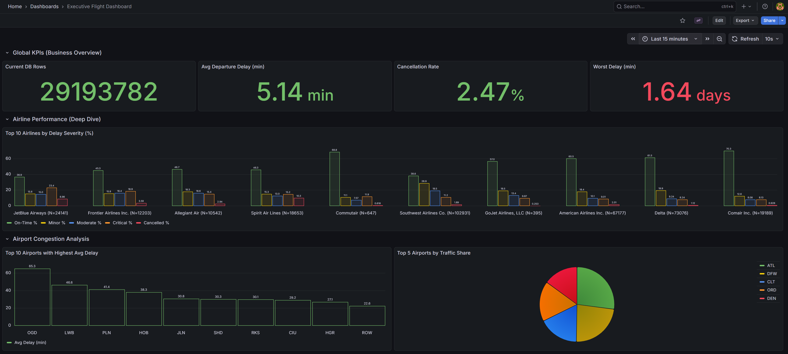

#  US Flights Real-Time Analytics Stack: ELT on Kafka & ClickHouse

[](https://kafka.apache.org/)
[](https://clickhouse.com/)
[](https://www.getdbt.com/)
[](https://grafana.com/)
[](https://www.docker.com/)
[](https://www.python.org/)
[](https://avro.apache.org/)

An End-to-End **High-Performance Data Engineering Project** designed for the real-time ingestion, validation, and analytical processing of over **25GB** of historical US civil aviation data (29M+ records).

This project demonstrates a production-grade **Streaming ELT architecture** optimized to operate on resource-constrained environments (**AWS EC2 4GB RAM**) while maintaining extreme throughput.

---

## 🏗️ Architecture

*(Space reserved for the architecture diagram)*


---

## 🎯 Project Overview & Technical Challenges

### High Throughput Ingestion (>80,000 rec/s)
The system is built to handle massive data streams by implementing a **Steady-Flow** pattern in Python. Using `multiprocessing` and asynchronous batching, the producers saturate network bandwidth efficiently, hitting picos of **100,000 records per second** on a dual-core machine.

### The Memory Challenge (Hard Limit: 4GB RAM)
Running a full streaming stack (Kafka, ClickHouse, Grafana, dbt) on just 4GB of RAM required surgical optimization:
*   **Kafka KRaft Mode**: Removed Zookeeper overhead for a lighter footprint.
*   **JVM Tuning**: Aggressive Heap memory management for Kafka and Schema Registry.
*   **ClickHouse Storage Policies**: Implemented a hybrid storage strategy, offloading compressed historical data directly to **AWS S3** while keeping active indexes in local SSD.

### Data Governance & DLQ
A native **Dead Letter Queue (DLQ)** implementation in ClickHouse ensures the pipeline never stalls. Corrupted or schema-mismatched messages are automatically diverted to a dedicated audit table for post-mortem analysis.

---

## 🚀 Performance Benchmarking

### Parquet vs. CSV Ingestion
This project highlights the efficiency of binary formats for large-scale data movements.

| Format  | Scaling Strategy | Throughput (Avg) | CPU Overhead | Payload Efficiency |
|---------|------------------|------------------|--------------|-------------------|
| **CSV** | Line-by-line     | ~20,000 rec/s    | High         | Low (Text)        |
| **Avro/Parquet** | Binary Batches | **85,000+ rec/s** | **Optimized** | **High (Compressed)** |

*(Space reserved for benchmarking visualization)*


---

## ⚙️ Data Layers (Medallion Architecture)

The logic is orchestrated using **dbt-clickhouse**, following an ELT pattern across three layers:

1.  **Bronze (Raw)**: Direct native landing from Kafka via `Kafka Engine`. Technical validation only.
2.  **Silver (Enriched)**: 
    *   **KPI Calculation**: Flight speed (MPH), delay severity (Minor, Moderate, Critical), and time recovery metrics.
    *   **Normalization**: Data type casting and schema alignment.
3.  **Gold (Analytics)**:
    *   **Delay Propagation**: Advanced sequence analysis by `TailNumber` to identify how early delays impact subsequent flights.
    *   **Operational Aggregates**: Top-performing airlines and airport congestion hotspots.

---

## 📊 Visual Insights

*(Space reserved for real-world execution screenshot)*


*The dashboard reflects real-time metrics, including average speeds, cancellation rates, and heatmaps of delay intensity across the US network.*

---

## 💻 Setup & Usage

### 1. Infrastructure Deployment
1.  **Clone the Repository**
    ```bash
    git clone https://github.com/your-username/us-flights-analytics.git
    cd us-flights-analytics
    ```

2.  **Start Services**
    ```bash
    docker-compose up -d
    ```

### 2. Database Initialization
Deploy the schemas and Materialized Views:
```bash
cat src/database/setup_ingestion.sql | docker exec -i clickhouse clickhouse-client -u admin --password admin --multiquery
```

### 3. Pipeline Execution
1.  **Ingestion Phase**:
    ```bash
    python3 src/producer/s3_full_ingestion.py
    ```
2.  **Transformation Phase (dbt)**:
    ```bash
    cd dbt_flights
    dbt run --profiles-dir .
    ```

---

## 👨💻 Author

**Victor García Dorador** - Data Engineer  
[LinkedIn](https://www.linkedin.com/in/v%C3%ADctor-garc%C3%ADa-dorador-50371121/)