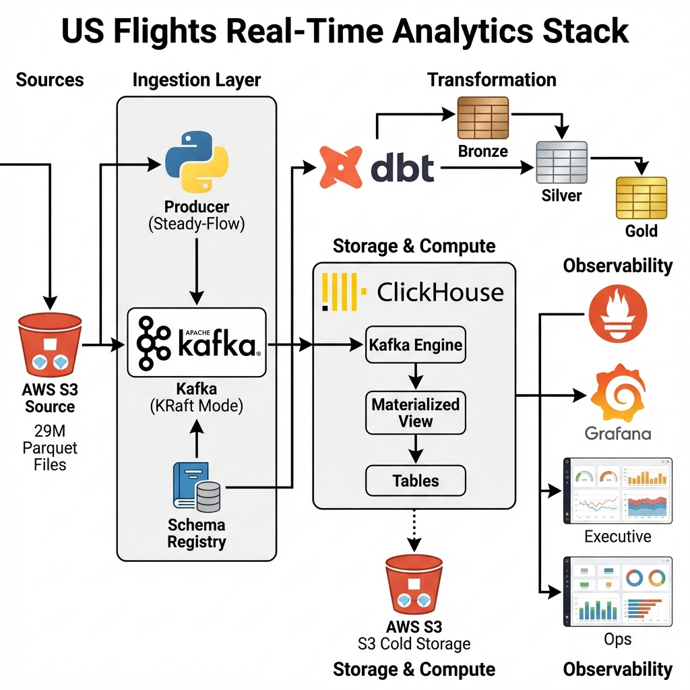
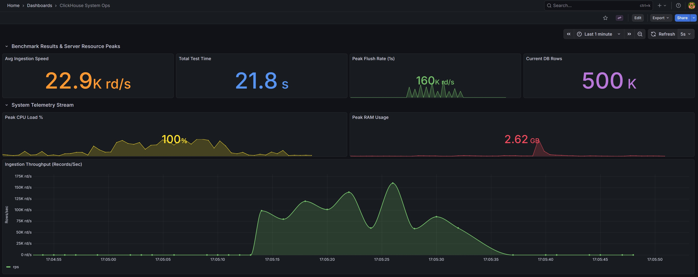
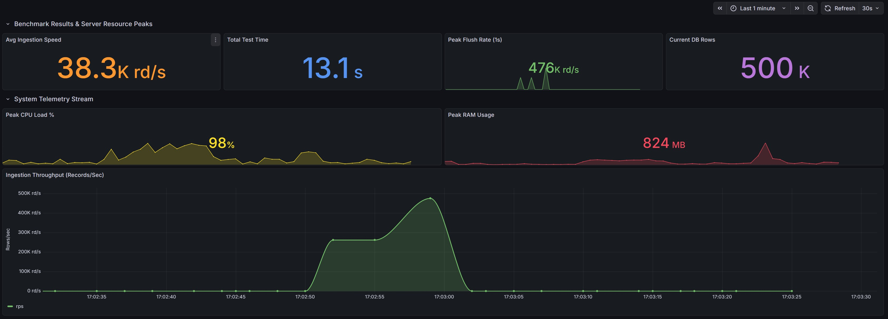
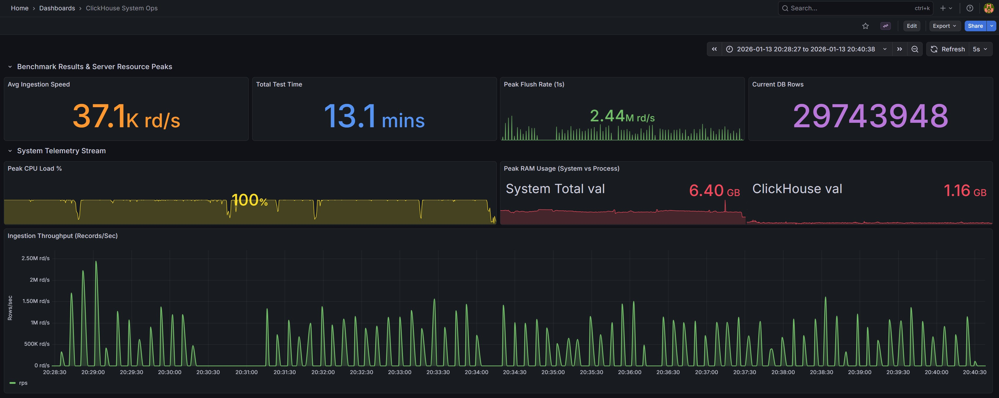

#  US Flights Real-Time Analytics Stack: ELT on Kafka & ClickHouse

[](https://kafka.apache.org/)
[](https://clickhouse.com/)
[](https://www.getdbt.com/)
[](https://grafana.com/)
[](https://www.docker.com/)
[](https://www.python.org/)
[](https://avro.apache.org/)

## 🎯 Project Objective: Full-Scale Analytical Pipeline

The primary goal of this project is the **end-to-end processing of 29 Million flight records** from the [US Flight Delay Dataset (2018-2022)](https://www.kaggle.com/datasets/robikscube/flight-delay-dataset-20182022/) available on Kaggle. The challenge was to build a production-ready streaming stack capable of handling this volume with real-time analytics, while restricted to a **4GB RAM** environment.

---

## 🏗️ Architecture



---

## ⚙️ Key Technical Pillars

### 1. High-Velocity Ingestor (>37,000 rec/s)
Developed a high-performance Python producer implementing the **Steady-Flow** pattern. By utilizing `multiprocessing` and Avro binary serialization, the system achieves extreme throughput, saturating the ingestion pipeline without overwhelming the limited CPU/RAM resources.

### 2. Infrastructure Optimization (**c7i-flex.large** Constraints)
Operating a multi-container stack (Kafka, ClickHouse, Grafana, Schema Registry) on a single **AWS EC2 c7i-flex.large** instance was a core engineering challenge.

**Hardware Specs:**
*   **CPU:** 2 vCPUs (1 Physical Core, 2 Threads) @ **3.2 GHz** (Intel Sapphire Rapids).
*   **Memory:** **4 GiB** DDR5 RAM.
*   **Network:** Up to **12.5 Gbps** bandwidth.
*   **Storage:** EBS-Optimized (Up to 10,000 Mbps).

**Optimization Strategy:**
*   **Kafka KRaft**: Zero-dependency coordination to save JVM overhead.
*   **JVM Minification**: Tailored heap limits for Kafka and Schema Registry to fit within the 4GiB boundary.
*   **S3 Storage Policy**: ClickHouse offloads compressed historical data to **AWS S3**, reserving local disk for active hot-data.

### 3. Native Data Governance (DLQ)
Equipped with a **Dead Letter Queue (DLQ)** implemented directly via ClickHouse Materialized Views. This ensures that any schema mismatch or corrupted data is diverted for audit without stopping the main ingestion stream.

---

## � Design Decisions & Preliminary Benchmarks

Before the full 29M record execution, a **preliminary design phase** was conducted to select the most efficient data format. 

Using a **500,000 record test set**, we compared the performance of different **source data formats** (CSV vs. Parquet) being serialized into **Avro** for Kafka ingestion. 

The benchmark revealed that parsing a 1.2GB+ dataset in CSV format created a severe bottleneck in the Python interpreter. Switching to **Parquet** allowed for vectorized reading of batches, enabling the producer to maintain a stable flow of over 37,100 records per second.

| Source Format | Ingestion Pattern | Throughput (Avg) | Bottleneck |
|---------------|-------------------|------------------|------------|
| CSV           | String Parsing    | ~22,900 rec/s    | CPU (I/O Wait) |
| **Parquet**   | **Vectorized Load** | **38,300+ rec/s** | **Network Bound** |

#### **Performance Comparison (Grafana Screenshots)**
*Visual validation of throughput difference using identical hardware resources.*




---

## 📊 Full-Scale Production Results (29 Million Records)

This section showcases the definitive execution of the entire dataset.

### **I. System Health & Performance (Ops Dashboard)**
*Captures the sustained ingestion speed, peak flush rates, and cluster resource stability during the 29M record stream.*


### **II. Business Insights (Executive Dashboard)**
*Aggregated analytics from the Gold Layer providing real-time metrics, including average speeds, cancellation rates, and insights into airline performance and regional congestion trends.*


---

## 📂 Data Layers (Medallion Architecture)

The logic is orchestrated using **dbt-clickhouse**, following an ELT pattern across three layers:

1.  **Bronze (Raw)**: Direct native landing from Kafka via `Kafka Engine`. Technical validation only.
2.  **Silver (Enriched)**: 
    *   **KPI Calculation**: Flight speed (MPH), delay severity (Minor, Moderate, Critical), and time recovery metrics.
    *   **Normalization**: Data type casting and schema alignment.
3.  **Gold (Analytics)**:
    *   **Delay Propagation**: Advanced sequence analysis by `TailNumber` to identify how early delays impact subsequent flights.
    *   **Operational Aggregates**: Top-performing airlines and airport congestion hotspots.

---

##  Setup & Usage

### 1. Infrastructure Deployment
1.  **Clone the Repository**
    ```bash
    git clone https://github.com/your-username/us-flights-analytics.git
    cd us-flights-analytics
    ```

2.  **Start Services**
    ```bash
    docker-compose up -d
    ```

### 2. Database Initialization
Deploy the schemas and Materialized Views:
```bash
cat src/database/setup_ingestion.sql | docker exec -i clickhouse clickhouse-client -u admin --password admin --multiquery
```

### 3. Pipeline Execution
1.  **Ingestion Phase**:
    ```bash
    python3 src/producer/s3_full_ingestion.py
    ```
2.  **Transformation Phase (dbt)**:
    ```bash
    cd dbt_flights
    dbt run --profiles-dir .
    ```

---

## 👨💻 Author

**Victor García Dorador** - Data Engineer  
[LinkedIn](https://www.linkedin.com/in/v%C3%ADctor-garc%C3%ADa-dorador-50371121/)